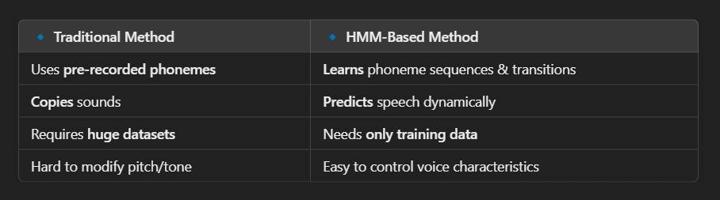

## Types of synthesiezer : 

## 👉 1) Formant based synthesizer

### 1️⃣ What Do Phonemes Have to Do with This?

- Phonemes are speech sounds that make up words.
- Example: The word `“cat”` has three phonemes: `/k/, /æ/, /t/`
- `Each phoneme has unique frequency patterns in a spectrogram.`

- Vowels = Clear formants (steady bands in spectrogram)
- Consonants = Noisy or sharp bursts (dispersed energy)

So, `when we analyze vowels/consonants using a spectrogram, we are actually analyzing phonemes!`

### 2️⃣ What Is Formant-Based Speech Synthesis?

- Now, let’s say we want a computer to speak like a human.
- Instead of recording a real voice, we can generate speech using math!
- This is where formant-based speech synthesis comes in.

#### How Does It Work?
- Each vowel phoneme has formants (resonant frequencies).
- Example: `/a/ in "cat" → Formants at 800 Hz, 1200 Hz, 2500 Hz`
- Example: `/i/ in "see" → Formants at 300 Hz, 2500 Hz, 3500 Hz`
- A speech synthesizer generates sine waves at these frequencies.
- For consonants, we add bursts of noise (for sounds like /s/, /t/).

- `So, instead of playing back a real recording, we recreate speech by adjusting formants and adding noise for consonants.`
- `This is how old-school robotic voices (like in early computers) worked! : SAM `

## 👉 2)  Concatenative Synthesizer

- Record a Large Database of Speech
- A speaker records phonemes, syllables, words, or phrases.
- `Example: Recording "ba", "at", "ka", "ro", "ma" separately.`
- Break the Audio into Small Units
- These small units can be:

    - Diphones (middle of one sound to the middle of the next)
    - Phonemes (smallest speech sounds)
    - Syllables
    - Words (for phrase-based synthesis)

-` Concatenate (Join) the Units`
- When text is given, the system finds the right recorded speech pieces.
- It blends them together smoothly to make it sound natural.

- `Example 🎵`
    - If we want to generate "bat", and we already have:
    - "ba" recorded separately
    - "t" recorded separately
    - The synthesizer joins them smoothly: `"ba" + "t" → "bat".`

## 👉 3) HMM based Synth : 

This code simulates an HMM-based speech synthesizer by:
- Training an HMM model using frequency patterns of phonemes.
- Predicting phoneme sequences for a given word (like "bat").
- Generating synthetic speech and saving it as a WAV file.

### so in hmm model we store not the phonemes but the freq of each phoneme / alphabets which make sound

- Instead of storing real phonemes, HMM predicts how a phoneme should sound based on probabilities.
- HMM predicts phoneme frequencies instead of using actual recordings.
- heres a complete process :

    1️⃣ We don’t store real audio clips of phonemes.

    2️⃣ Instead, we store frequency-based features of each phoneme (e.g., formant frequencies, spectral characteristics).

    3️⃣ HMM learns how phonemes transition from one to another using probabilities.

    4️⃣ When synthesizing speech, HMM generates a sequence of frequencies based on the learned phoneme transitions.

    5️⃣ These frequencies are then converted into waveforms to create artificial speech.

- here, `trad method` == `concatinative`

### is hmm training data == all alphabets --> NOPE ? 

- What Does HMM Train On?
    - Not full alphabets (A-Z), `but phonemes (like /k/, /æ/, /t/ for "cat").`
    - It learns patterns in phoneme frequency from the given dataset.
    - It does not store audio clips, but it models frequency transitions between phonemes.

- in our expt .. we trained it on `"c", "a", "t", "d", "o", "g" phonemes.`

### can HMM have emotions / prosody ? 

- Yes, HMM-based synthesis can model prosody (intonation, stress, rhythm) and emotions by incorporating additional features in the training data. 
- However, standard HMM speech synthesis primarily focuses on phoneme sequences and lacks natural prosody unless explicitly modeled.

#### how  to add ?

- change training data 
    - modify the feature set used for training. 
    - This involves training HMM models not just on phonemes but also on prosodic elements like pitch, duration, and energy.

- Train Emotion-Specific HMM Models:

    - Instead of a single model, train separate HMMs for neutral, happy, sad, angry, etc.
    - Use labeled emotional speech datasets (e.g., EMO-DB, RAVDESS, IEMOCAP).
    - Train a model per emotion or use an additional parameter to indicate emotion.

- Extend HMM states to encode pitch and duration variability.
- Use prosody-aware vocoders (e.g., WORLD vocoder).

`so it is possible but takes extra steps !!!`

## 👉 Vocoders :

- A vocoder (Voice Encoder) is a digital signal processing tool that analyzes and synthesizes speech by separating the speech content (phonemes, articulation) from the tone (pitch, energy, prosody).
- It is used in speech synthesis to reconstruct natural-sounding voices from extracted features.
- What Does a Vocoder Get as Input and Output?
- Input:

    - Vocoders take spectral features of speech, typically MFCCs (Mel-Frequency Cepstral Coefficients), Mel spectrograms, or excitation signals (F0, periodicity, energy, etc.).
    - Some vocoders also take text-to-speech (TTS) phoneme sequences.

- Output:

    - They generate a continuous audio waveform, reconstructing human speech.
    - The output is a fully synthesized voice, which can sound robotic or natural depending on the vocoder quality.

