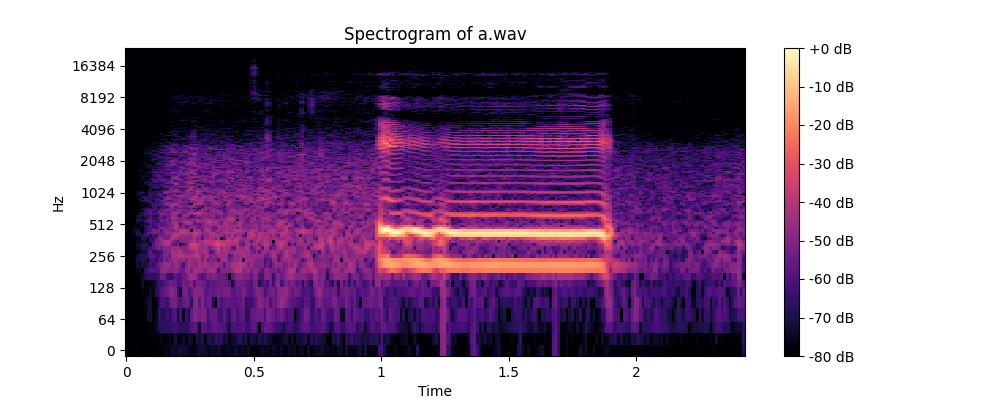
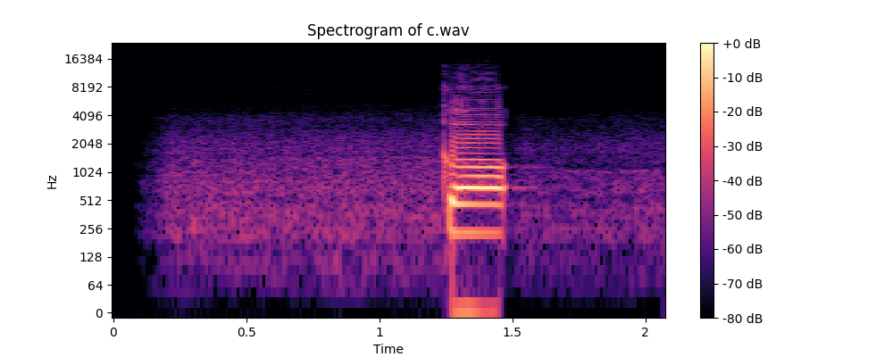

## 1) understand formants via spectograms 

### code file : `1_SpectralDiff_in_consonants_vowels`
-------------------------


- clear bands on spectogram
- Formants are the natural "shape" of a sound when we speak. They are the strongest parts of the sound that help us tell vowels apart. 
- Your mouth, tongue, and lips act like a musical instrument that changes the sound.
- Example:
`Say "eee" (like in "see"). Your tongue is high, and this creates certain formants.`
`Now say "ooo" (like in "boot"). Your lips are rounded, changing the formants.`
- the first 2 formants for every sound ( F1 , F2) -> are of most impt

### spectrogram is like a "picture" of sound over time. It shows:
---------------------------------

- Time (left to right)
- Frequency (bottom to top, like pitch)
- Dark areas (show where the strongest sound is)

`Vowels have clear bands of dark lines (these are formants).`
`Consonants are more chaotic—some look fuzzy, some have quick jumps.`

### how to run :
-----------------
-  run `pip install -r requirements.txt`
- make a folder of `.wav` file : `wav_files\b.wav`
- in code enter that : 

-` how it works : `
Computes spectral features:
    - Spectral Centroid (higher for consonants, lower for vowels).
    - Spectral Flatness (higher for noisy sounds like consonants).

- `Classifies:`
    - If the centroid is low and flatness is low → Vowel.
    - Else → Consonant.
    - Displays a Spectrogram for visualization.

### Spectograms via our code : 
--------------------------------

- the reason y `b` came as a vowel .. coz b was told as `beeeee` 
- instead it should have beeb `buh` .. just like we said `sssss` for `s`
- similar for `c`


- spectograms images : check `spectogram_output`
 
 
 
 
 
 


----------------------------

## 2) Understnad how HMM based works 

### code file : `TTS_deepDive\code files\2_HMM_based_synth.py`

- 1) beep one : we defined freq : [exp 1](code%20files/2_HMM_based_synth_1stTime.py)
- 2) we gave smaple audio files : [exp 2](code%20files/2_HMM_based_synth_2ndTime.py)
------------------

### some public datasets for phoneme data : 
-----------------------

1️⃣ TIMIT Dataset (Phoneme-labeled speech corpus)

    - Link: https://catalog.ldc.upenn.edu/LDC93S1
    - Contains phoneme-labeled speech recordings
    - Used for training HMM-based TTS systems

2️⃣ LibriSpeech (Large speech corpus for phoneme modeling)

    - Link: https://www.openslr.org/12
    - Provides clean & noisy speech data
    - Great for HMM-based and deep learning speech synthesis

3️⃣ VoxForge (Open-source speech corpus)

    - Link: http://www.voxforge.org
    - Community-driven phoneme-labeled speech
    - Useful for training HMM-based and statistical TTS models

4️⃣ CMU Pronouncing Dictionary (Phoneme dictionary for words)

    - Link: https://www.speech.cs.cmu.edu/cgi-bin/cmudict
    - Provides phoneme transcriptions of English words
    - Can be used to map words to phonemes in an HMM model


### phonemes by timit dataset 
--------------


### HMM based expt outputs

- 1st Time
    - output in : [Expt 1](code%20files/2_HMM_based_synth_1stTime.py) : `we hear a beep only` ... as we used simple freq
    - You need real phoneme features – like MFCCs (Mel-Frequency Cepstral Coefficients) to synthesize speech properly.

- 2nd Time
    - output in : [ Expt 2](code%20files/2_HMM_based_synth_2ndTime.py) : we train on audio files -> so we hear the word
    - Extracts `MFCCs from real speech samples `
    - Trains an HMM model on phoneme sequences
    - Generates new phoneme sequences using the trained HMM
    - Synthesizes speech audio based on the HMM output

- in both word not heard .. need to do better
- in [MFCC path](<MFCC output>) -< we see the mfcc graphs of both the audio 
    -  -> `beep one`
    -  -> computer specking one

## Vocoders :

- in our [ Expt 2](code%20files/2_HMM_based_synth_2ndTime.py) 
- `new_features` has list of all MFCC features : 
 
- our function : `synthesize_audio(new_features)` -> we input these features -> make use of `LIM GRIFFIN VOCODER` 
- thereby we get a new audio file : `dog_output_2.wav`

```python
def synthesize_audio(mfcc_features, output_file="dog_output_2.wav", sr=16000):
    """Convert MFCC back to waveform using Griffin-Lim algorithm. -> this is a vocoder"""
    reconstructed_audio = librosa.feature.inverse.mfcc_to_audio(mfcc_features.T)
    sf.write(output_file, reconstructed_audio, sr)
    print(f"Generated speech for 'dog' saved to {output_file}")

```